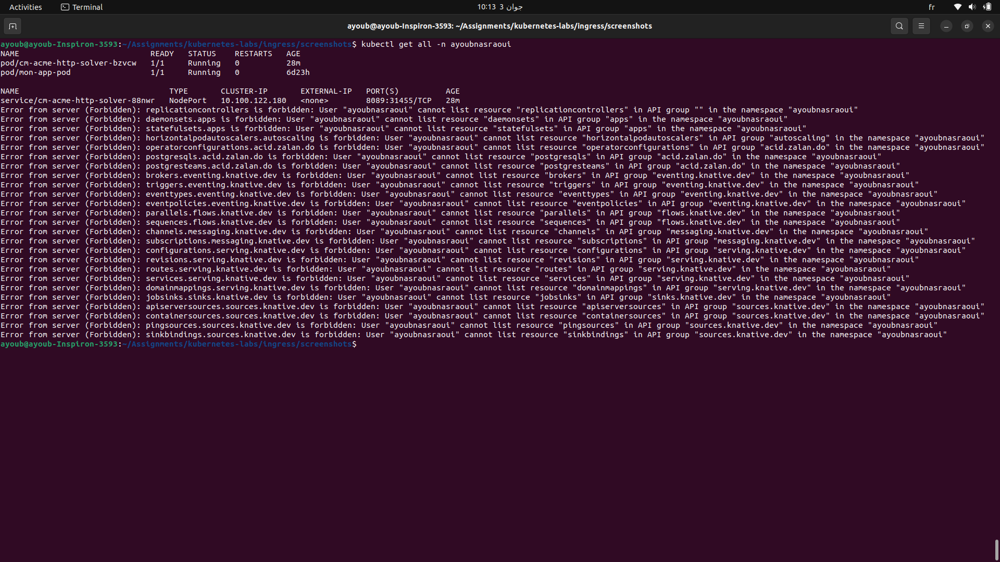
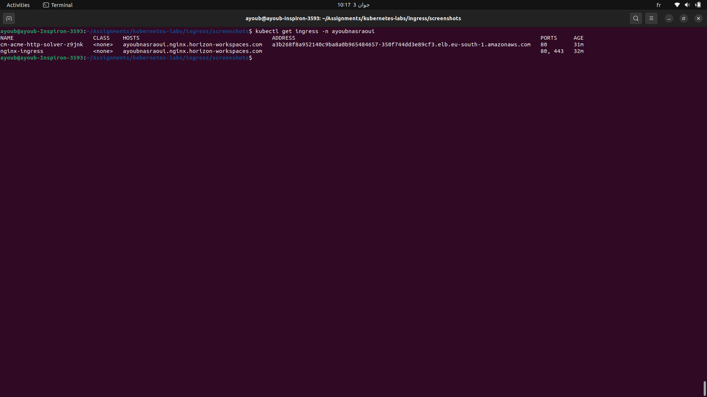

# Kubernetes Ingress Lab – Horizon Workspaces
## Overview

This lab demonstrates the deployment and exposure of Kubernetes services using an **Ingress Controller** on a school-provided cluster managed through **Horizon Workspaces**. The setup includes:

- Deploying applications in a namespace
- Setting up an NGINX Ingress Controller
- Exposing services via an Ingress resource
- Accessing services through a custom domain
## demo


## Namespace

All resources are deployed under the following namespace:


## Ingress Setup

Two Ingress resources were created:

1. **cn-acme-http-solver-z9ink** – For ACME challenge solving (Cert-Manager use)
2. **nginx-ingress** – The main Ingress routing traffic to backend services

You can verify them with:

```bash
kubectl get ingress -n ayoubnasraoui
