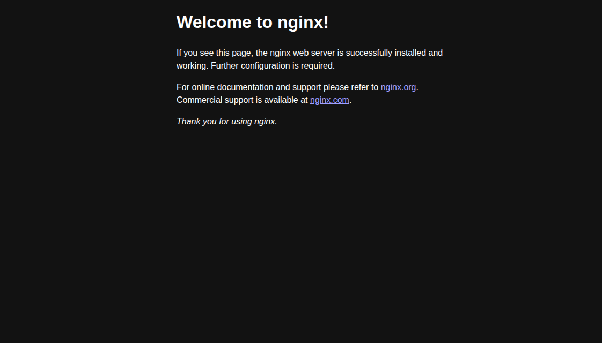

# NGINX Deployment on Kubernetes

This project demonstrates how to deploy an NGINX web server on Kubernetes, expose it using a ClusterIP service, and access it via port-forwarding.

---

## 📦 1. Deployment

We created a Kubernetes Deployment using the official `nginx:latest` image.

**File:** `nginx-deployment.yaml`
```yaml
apiVersion: apps/v1
kind: Deployment
metadata:
  name: nginx-deployment
spec:
  replicas: 1
  selector:
    matchLabels:
      app: nginx
  template:
    metadata:
      labels:
        app: nginx
    spec:
      containers:
      - name: nginx
        image: nginx:latest
        ports:
        - containerPort: 80
```
## 🌐 2. ClusterIP Service
We exposed the deployment using a ClusterIP service, which allows internal communication within the cluster.

**File** `nginx-service.yaml`
```yaml
apiVersion: v1
kind: Service
metadata:
  name: nginx-service
spec:
  selector:
    app: nginx
  ports:
    - protocol: TCP
      port: 80
      targetPort: 80
  type: ClusterIP
```
## 3.Commands

to start deployment
 
```bash
kubectl apply -f nginx-deployment.yaml
```

to start the ClusterIP service

```bash
kubectl apply -f nginx-service.yaml
```

## 🔁  Port forwarding the service

```bash
kubectl port-forward service/nginx-service 8080:80
```

### finally: open navigator and past the link: http://localhost:8080
You should see the default NGINX Welcome Page.

### Conclusion

This setup shows how to deploy a basic web server in Kubernetes and make it accessible for local development using a ClusterIP service and port-forwarding.


